# Microsoft Entra ID Tenant Hardening

## Overview

This project builds on my Microsoft Entra ID Identity Baseline project by focusing on securing and hardening the KD Identity Solutions tenant.

After establishing the workforce identity environment, I performed a security posture review of administrative access, authentication methods, privileged identities, and tenant-wide security settings. I then implemented targeted hardening changes and used Microsoft Entra audit logs to validate the changes.

The goal of this project was to approach the tenant from an identity security perspective: identify weaknesses, make defensible security improvements, and document the evidence behind those changes.

## Environment

- Microsoft Entra ID
- Microsoft Entra Free
- Microsoft Authenticator
- Passkeys (FIDO2)
- Microsoft Entra RBAC
- Security Defaults
- Entra Audit Logs
- Fictional organization: KD Identity Solutions

## Security Assessment

I began by reviewing the tenant's existing security posture.

The assessment included:

- Global Administrator assignments
- User Administrator assignments
- Tenant Security Defaults
- Available authentication methods
- Microsoft Authenticator configuration
- Passkey (FIDO2) configuration
- Privileged identity separation
- Emergency administrative access

The baseline showed that Security Defaults were already enabled, so I retained the existing protection rather than disabling it simply to create additional configuration changes.

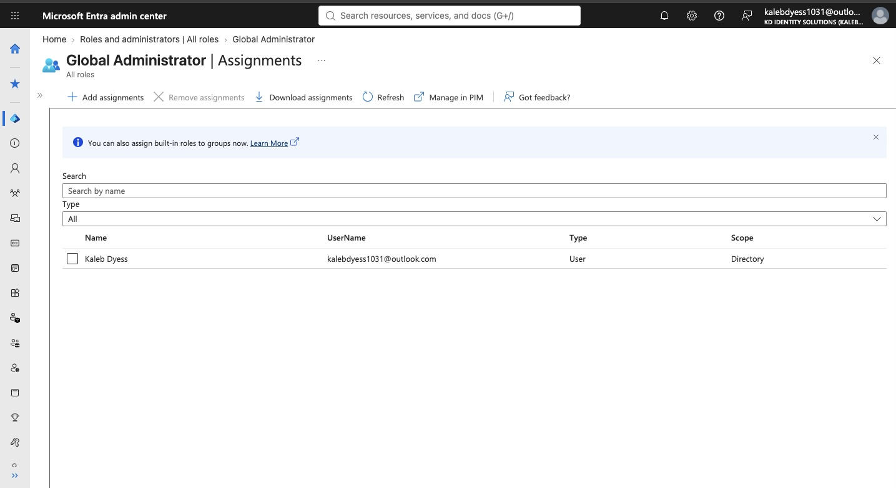

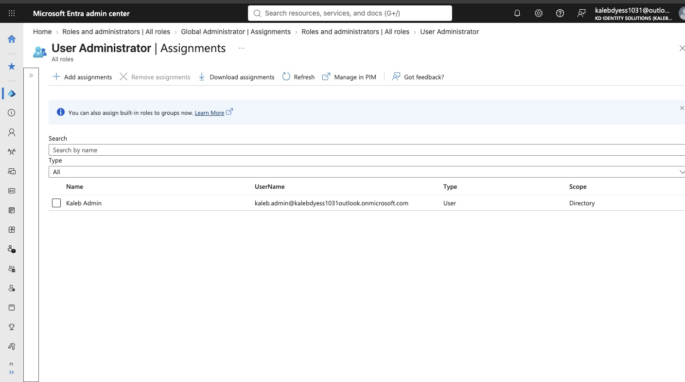

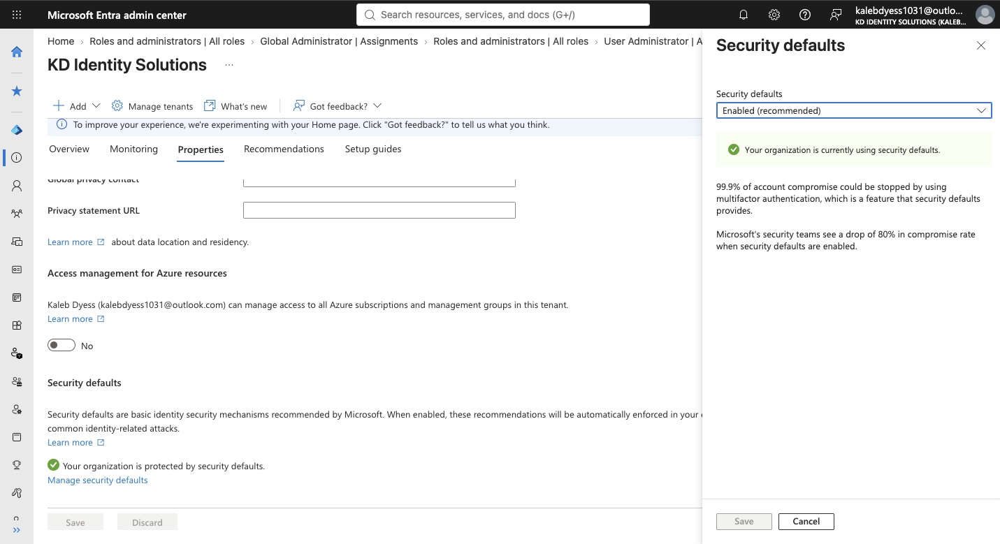

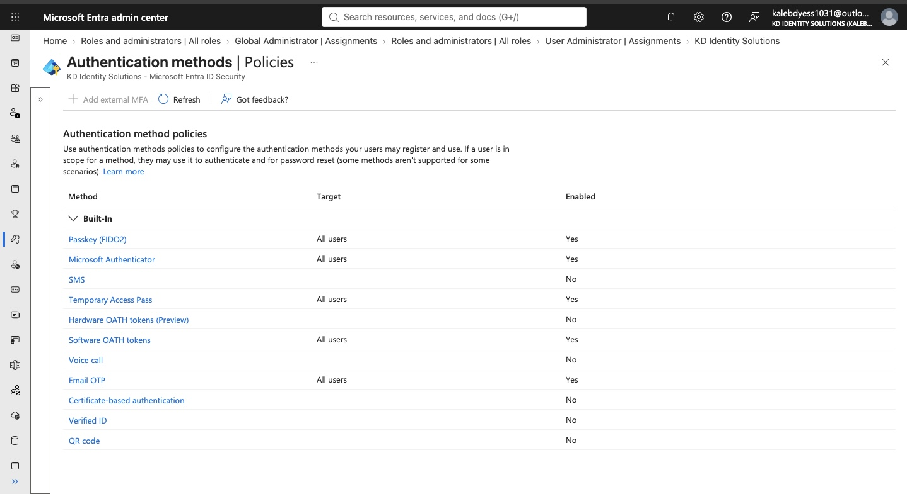

## Microsoft Authenticator Hardening

Microsoft Authenticator was already enabled for the tenant and number matching was already active.

Instead of changing controls that were already securely configured, I focused on improving the context presented during authentication requests.

I explicitly enabled:

- Application name in push and passwordless notifications
- Geographic location in push and passwordless notifications

Providing additional context helps users evaluate authentication requests and identify unexpected or suspicious sign-in attempts.

### Before

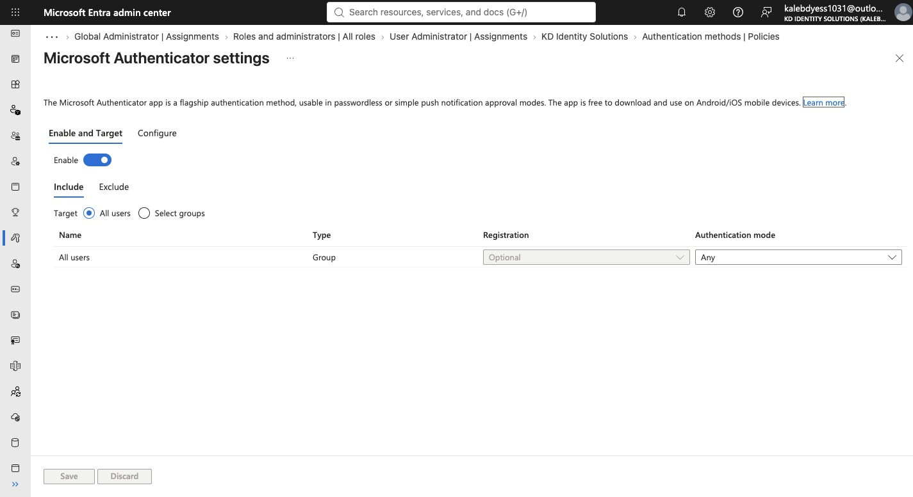

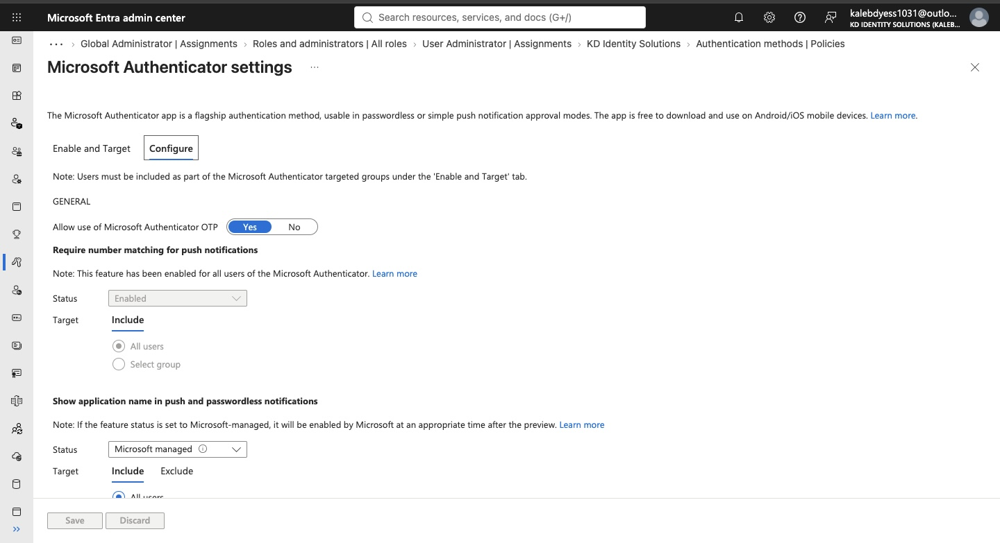

### After

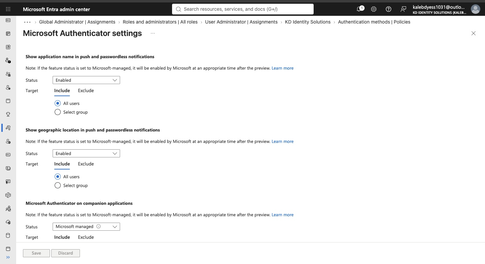

### Audit Validation

I reviewed the Entra audit logs to confirm that the authentication policy modification was recorded.

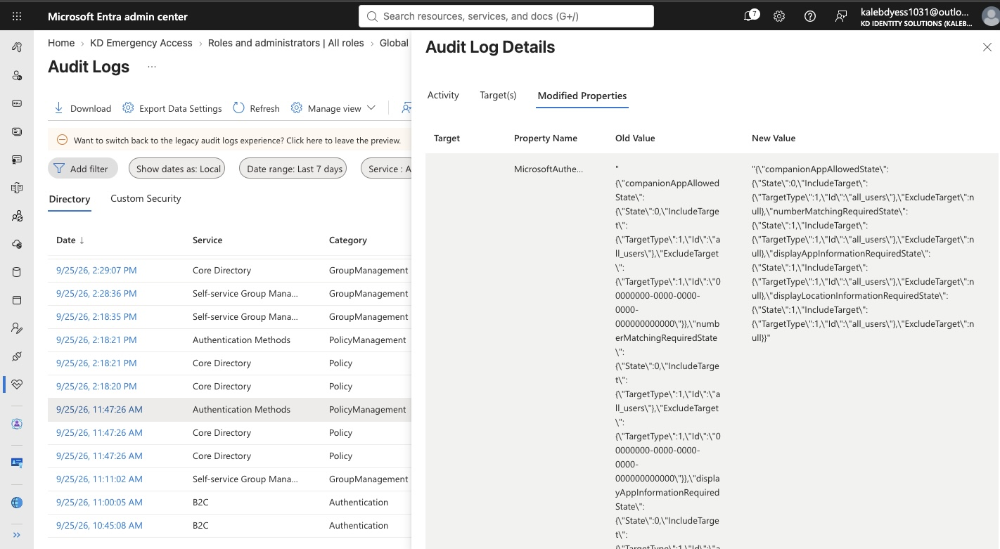

## Privileged Administrator Passkey Design

The baseline passkey configuration allowed all users to use the default passkey profile.

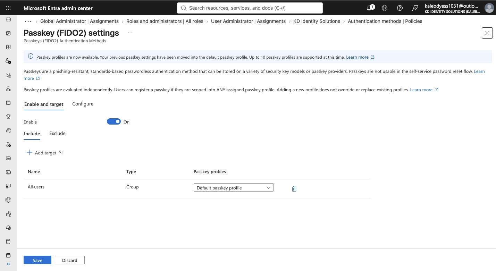

The default profile supported both device-bound and synced passkeys without attestation enforcement.

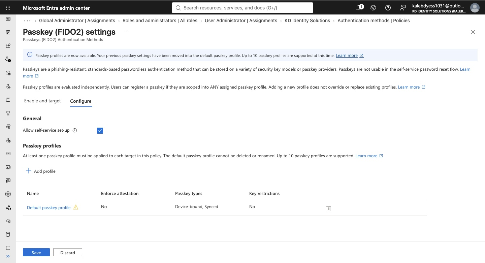

To establish a stronger authentication configuration for privileged identities, I created a dedicated security group:

**SG-Privileged-Admins**

The dedicated administrative identity, Kaleb Admin, was added to this group.

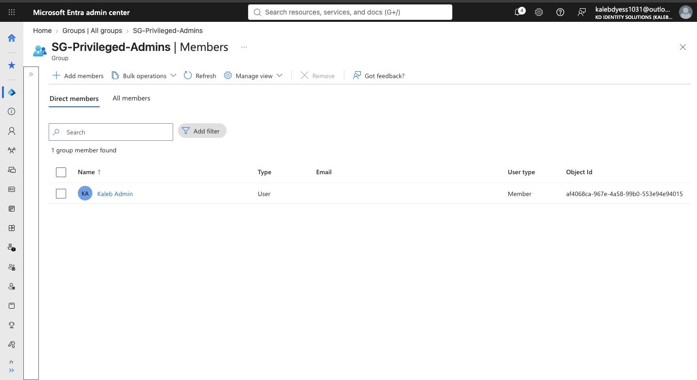

I then created a dedicated passkey profile named:

**KD Privileged Admin Passkeys**

The profile was configured for stronger privileged-user authentication requirements, including device-bound credentials and attestation, and targeted to the privileged administrator group.

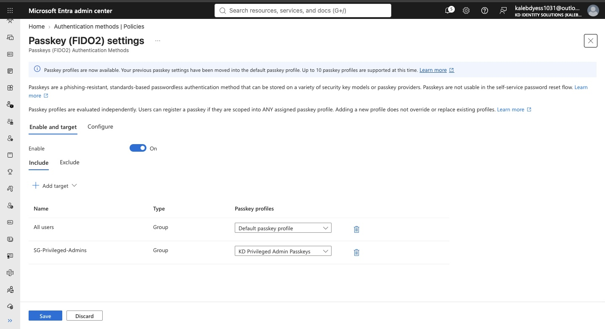

Because Entra evaluates assigned passkey profiles independently, membership in the privileged profile does not automatically replace other passkey profiles that also apply to the same user. This implementation therefore demonstrates privileged authentication profile design and targeting without claiming exclusive enforcement over the tenant-wide default profile.

### Audit Validation

Changes to the passkey configuration and targeting were validated through Entra audit logs.

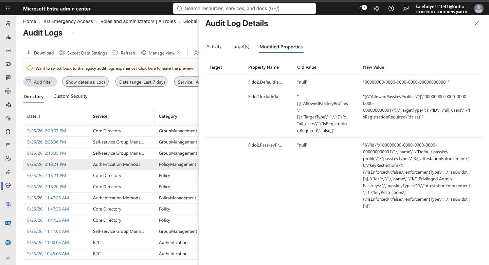

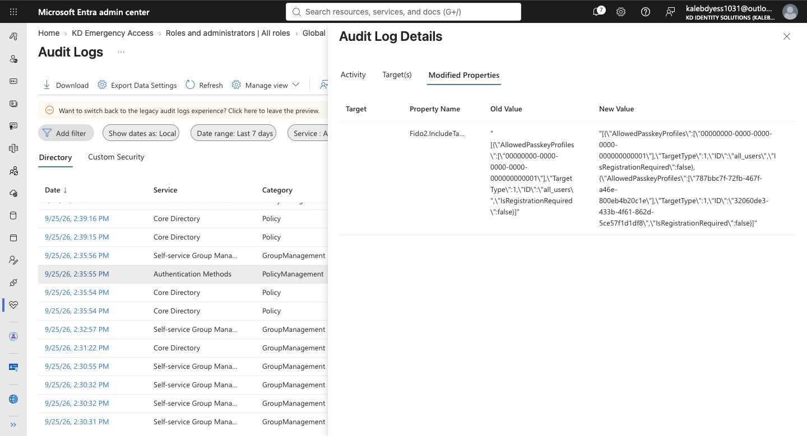

## Emergency Access Administration

The original tenant had a single Global Administrator tied to the primary account.

To improve administrative resiliency, I created a dedicated cloud-only emergency access identity:

**KD Emergency Access**

The account was assigned the Global Administrator role and reserved for emergency administrative recovery scenarios.

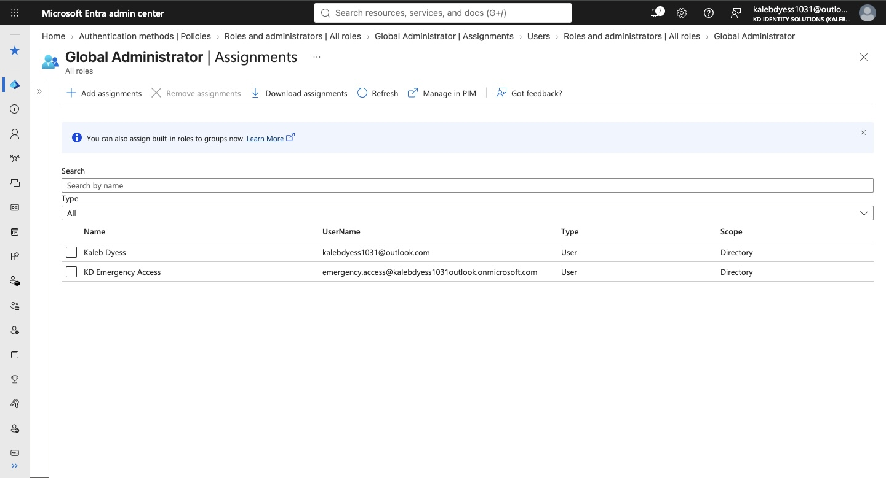

I validated the emergency account by signing into the Microsoft Entra admin center in a separate private browser session and confirming that the account could access the tenant with its assigned Global Administrator privileges.

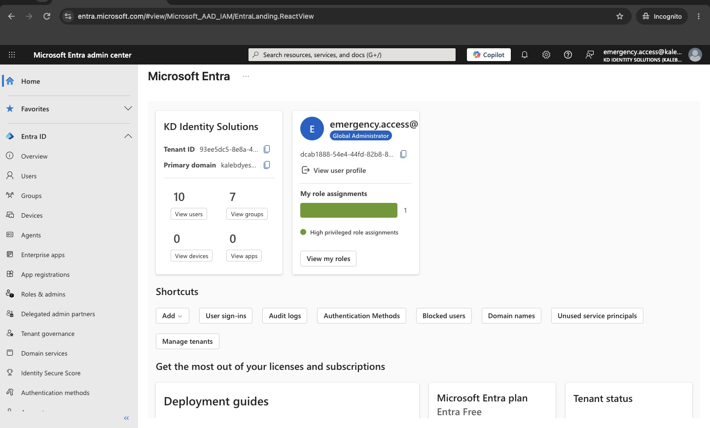

The role assignment was also verified through the Entra audit logs.

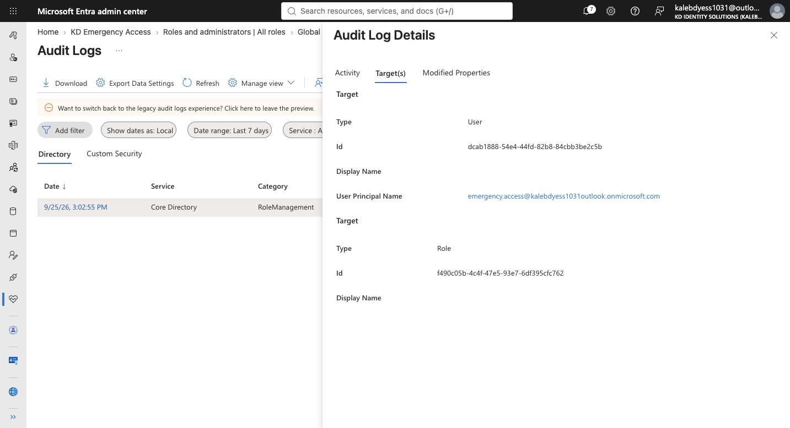

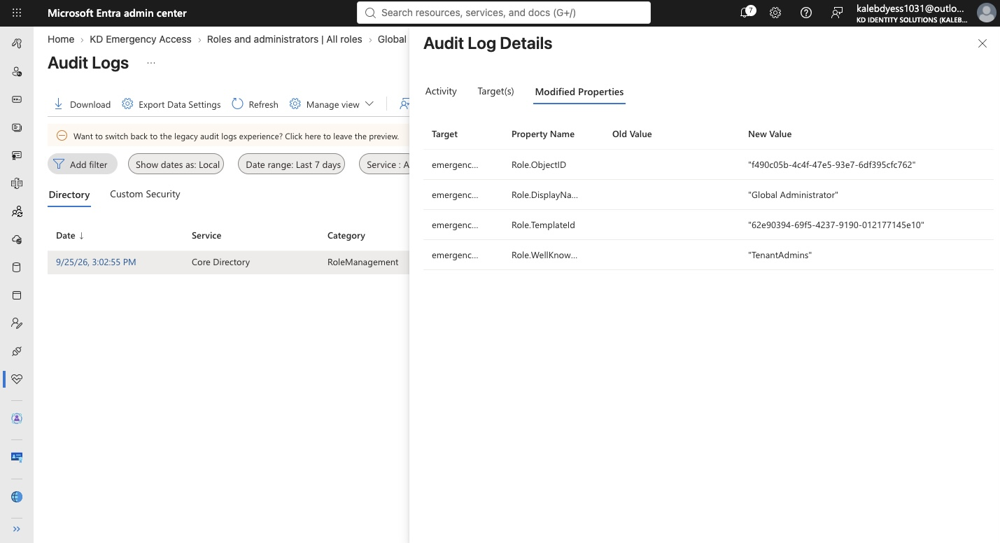

In a production environment, additional emergency access identities and stronger operational controls would be appropriate to reduce reliance on a single recovery account.

## Security Improvements

The hardening process resulted in several improvements to the KD Identity Solutions tenant:

| Area | Baseline | Hardening Action |
|---|---|---|
| Security Defaults | Enabled | Reviewed and retained |
| Authenticator number matching | Enabled | Retained |
| Authenticator context | Microsoft-managed | Explicitly enabled application and geographic context |
| Privileged authentication | General tenant passkey profile | Created dedicated privileged-admin passkey profile and targeting |
| Privileged identity organization | No dedicated privileged group | Created SG-Privileged-Admins |
| Emergency administration | Primary Global Administrator only | Added dedicated emergency access identity |
| Change validation | Configuration review | Validated security changes through Entra audit logs |

## Security Design Decisions

A major part of this project was determining when **not** to make a change.

Security Defaults and Authenticator number matching were already providing security protections, so I retained those configurations instead of disabling or modifying them unnecessarily.

I also separated administrative identities from normal workforce users and created dedicated security structures for privileged authentication.

This reflects a least-privilege and defense-in-depth approach rather than treating tenant hardening as simply enabling as many settings as possible.

## Licensing and Lab Limitations

This project was completed using Microsoft Entra Free.

Because of the lab environment and licensing limitations, advanced controls such as Conditional Access, Privileged Identity Management, and Identity Protection were not implemented as part of this project.

Those capabilities are intentionally addressed separately in later identity security projects.

The privileged passkey configuration also demonstrates profile creation and targeting rather than claiming exclusive enforcement, because users can be scoped into multiple independently evaluated passkey profiles.

For a production deployment, I would also maintain multiple dedicated emergency access accounts and establish formal monitoring, credential storage, testing, and recovery procedures around them.

## Skills Demonstrated

- Microsoft Entra ID administration
- Identity security assessment
- Authentication method policy management
- Microsoft Authenticator hardening
- Passkeys / FIDO2
- Privileged identity design
- Security groups
- Role-Based Access Control (RBAC)
- Global Administrator management
- Emergency access planning
- Security Defaults
- Audit log analysis
- Least privilege
- Defense in depth
- Security documentation

## Key Takeaways

This project strengthened my understanding of tenant hardening as more than changing security settings.

Effective identity security requires understanding the existing environment, identifying actual weaknesses, preserving controls that are already secure, separating privileged access, strengthening authentication, planning for administrative recovery, and validating changes through logs.

This project also reinforced the importance of accurately documenting the difference between a security control being configured, targeted, and fully enforced.
